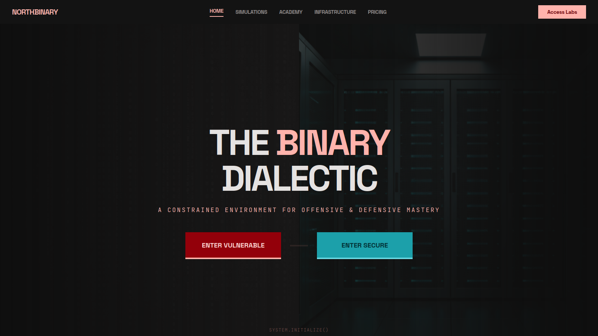

# NorthBinary – Web Security Simulation & Attack Analysis Platform

---

## 🚀 Features  

- **Vulnerable vs Secure Modules**  
  Interactive labs demonstrating real-world vulnerabilities (SQLi, XSS, CSRF, SSRF, LFI/RFI) and their secure implementations.

- **Real-Time Attack Detection Engine**  
  Custom-built detection system that identifies malicious patterns in requests (injection attempts, abnormal behavior).

- **Advanced Logging System**  
  Secure login and registration system powered by JWT authentication.
  - Full request logging including:
    - IP address
    - User agent
    - Payload
    - Endpoint
    - Severity & tags 

- **Live Security Feed (SOC-style UI)**  
  Visualize attacks in real time with a terminal-like interface.

- **Secure Authentication System**  
  - JWT-based authentication with:
    - Password hashing (bcrypt)
    - Rate limiting (anti-brute-force)

- **Rate Limiting Protection**  
  Prevents credential stuffing and brute-force attacks.

- **WAF Simulation Layer**  
  Built-in request filtering and detection mimicking real Web Application Firewalls.

- **Security Analytics Dashboard (in progress)**  
  Monitor attack frequency, behavior patterns, and system activity.

- **Educational Cybersecurity Labs**  
  Designed for learning offensive & defensive security concepts step-by-step.

---

## 🛠 Tech Stack

- **📱 Frontend (Mobile)**
    - [Vite](https://vite.dev/) – Fast development environment
    - [Tailwind CSS](https://tailwindcss.com/) – API communication
    - [React](https://react.dev/) – UI development

- **Backend:**  
  - [Python](https://flask.palletsprojects.com/en/stable/) – REST API
  - [MySQL](https://www.mysql.com/) – Database management
  

---

## 💡 Future Enhancements

- Real-time log streaming (WebSockets) 
- AI-based anomaly detection
- IP geolocation tracking (attack origin visualization)
- Advanced SOC dashboard (charts, heatmaps)
- Automated blocking system (dynamic IP banning)
- Cloud deployment with reverse proxy + WAF
- Mobile companion app

---

## ⚠️ Status

- **This project is currently in active development**
- Designed for educational and demonstration purposes
- Some modules are intentionally vulnerable
- Continuous improvements and security enhancements are planned

## 👨‍💻 Developer

m223rx – 2026

© 2026 m223rx. All rights reserved.
